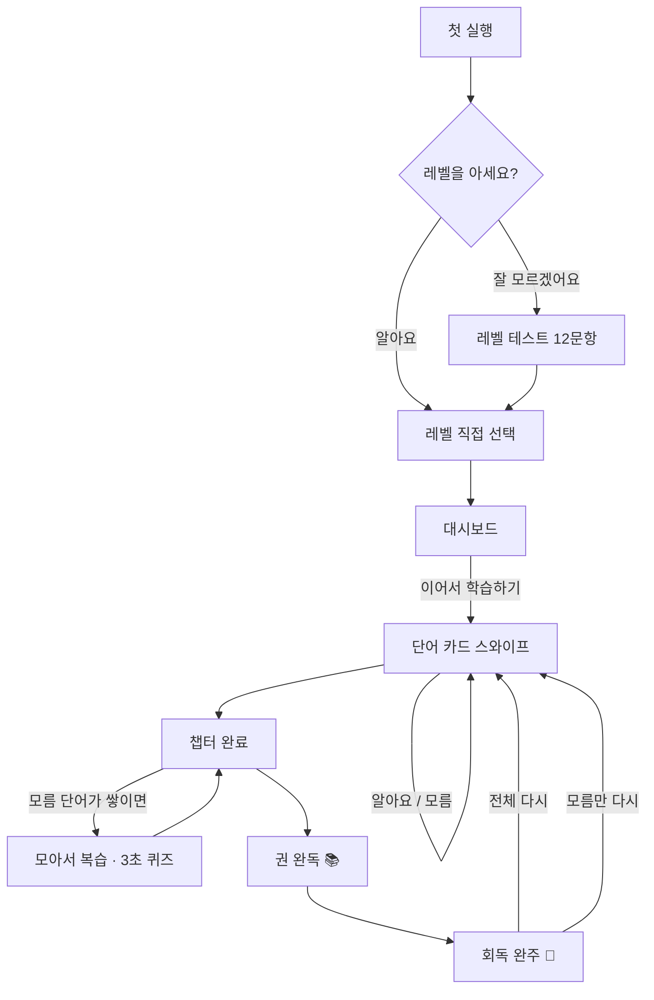

# NINE90 유저 플로우

> 처음 여는 순간부터 마스터까지 — 사용자가 앱에서 겪는 모든 흐름을 정리한 문서입니다.
> 화면 명칭은 앱 코드의 뷰 이름과 일치합니다.

## 한눈에 보기

---

## 1. 첫 만남 — 내 레벨 찾기

| 단계 | 화면 | 흐름 |
|------|------|------|
| 1 | 온보딩 (ScoreBandPickerView) | 4개 레벨 카드 중 선택. 각 레벨은 고유 색을 가집니다 — 입문(라임) · 중급(옐로) · 중상급(블루) · 고급(라벤더) |
| 2 | 레벨 테스트 (LevelTestView) | "잘 모르겠어요?" 버튼 → 12문항 뜻 맞추기. 난이도별 가중 배점으로 레벨을 추천하고, 어려운 문제를 맞히면 그만큼 높은 레벨이 나옵니다 |
| 3 | 시작 | "시작하기" → 대시보드. 콘텐츠는 백그라운드에서 자동 다운로드됩니다 |

- 로그인·회원가입이 없습니다. 열자마자 학습이 시작됩니다.
- 레벨은 언제든 바꿀 수 있고(대시보드 좌측 상단 필 버튼), 레벨별 진도는 각각 보존됩니다.
- 레벨 테스트는 대시보드의 🎓 버튼으로 언제든 다시 볼 수 있습니다.

## 2. 매일의 루프 — 회독

**핵심 구조**: 단어 10개 = 1챕터, 챕터 10개 = 1권. 모든 챕터를 돌면 1회독 완주.

1. **대시보드 → 이어서 학습하기** — 항상 다음 할 일 하나를 가리킵니다. 고민할 필요가 없습니다.
2. **단어 카드 (CardsView)** — 카드를 넘기며 답합니다.
   - **알아요** (민트) / **모름** (코랄) 두 가지뿐.
   - 카드에는 발음기호, 어원·연상 힌트, 비즈니스 예문과 번역이 함께 나옵니다.
   - 🔊 버튼으로 단어와 예문을 원어민 음성으로 들을 수 있습니다.
3. **챕터 완료** — 자동으로 다음 챕터를 제안합니다(4초 카운트다운). 건너뛴 챕터가 있으면 그쪽으로 되돌아갑니다.
4. **권 완독 → 회독 완주** — 마지막 챕터를 끝내면 축하 화면과 함께 다음 회독을 선택합니다:
   - **전체 다시**: 모든 단어를 새 순서로 (위치 암기 방지 셔플)
   - **모름만 다시**: 아직 못 외운 단어만 챕터로 재구성

**마스터 규칙**: 연속 2회독에서 "알아요" = 마스터. "모름"을 누르면 스트릭이 리셋되어 다시 반복 대상이 됩니다.

## 3. 모름 단어 — 집요하게

모름 단어의 유일한 규칙: **"알아요"를 받아야만 목록에서 사라집니다.** 다시 학습하든, 앱을 껐다 켜든, 세션을 중단하든 그대로 남습니다.

| 진입점 | 흐름 |
|--------|------|
| 챕터 완료 화면 | "모름 N개 복습" (스와이프) 또는 "뜻 퀴즈" |
| 대시보드 모름 카드 | 항상 표시. [복습] [퀴즈] 버튼 — 0개면 "깔끔해요!" |
| 자주 틀린 단어 랜덤 학습 | 지금 모름 목록에 없어도, 틀린 이력이 있는 단어 중 10개를 가중 랜덤으로 출제 |

**3초 퀴즈 (WordQuizView)**: 화면 테두리가 시계방향으로 사라지는 3초 안에 뜻을 고릅니다.
- 정답 → 알아요 처리, 모름 목록에서 즉시 삭제
- 오답·시간 초과 → 모름 유지, 자동으로 다음 문제
- 끝나면 "틀린 단어만 다시"로 반복

복습 세션은 시작한 곳으로 돌아갑니다 — 대시보드에서 시작했으면 대시보드로, 챕터에서 시작했으면 챕터로.

## 4. 진도 읽기 — 책장

대시보드의 책장은 실제 책꽂이처럼 읽힙니다:

- **책 1권 = 100단어**. 커버 색: 완독(민트) / 읽는 중(레벨 색) / 미시작(회색)
- **빨간 책갈피** = 지금 읽는 책
- **책등 색** = 난이도 구간 (기초 민트 → 중급 옐로 → 심화 코랄)
- 책을 탭하면 그 권의 챕터 10개가 그리드로 — ✓ 완료, ▶ 현재 위치, 게이지는 부분 진행
- 모든 챕터는 자유롭게 이동 가능. 완료 판정은 위치가 아니라 실제 학습 데이터 기준

## 5. 무료와 전체 이용권

- **무료**: 레벨별 앞 3챕터. 회독·모름 단어·퀴즈·레벨 테스트 전부 체험 가능
- **전체 이용권**: 1회 구매(비소모성)로 4개 레벨 전 챕터 영구 해제
- 잠긴 챕터는 🔒 표시, 탭하면 구매 화면
- 재설치·기기 변경 시 "구매 복원" 한 번이면 됩니다 (Apple ID 기준, 로그인 불필요)

## 6. 기록은 사라지지 않습니다

- 진도, 회독 수, 마스터 단어, 스트릭이 **iCloud에 자동 백업** — 앱을 지웠다 깔아도 그대로
- 학습 콘텐츠는 기기에 캐시되어 **오프라인에서도 학습 가능**
- 완전히 새로 시작하고 싶다면: 설정 → 학습 데이터 초기화 (기기 + iCloud 모두 삭제, 되돌릴 수 없음)

---

*앱 버전과 함께 갱신됩니다. 화면 흐름이 바뀌면 이 문서도 함께 수정해 주세요.*
